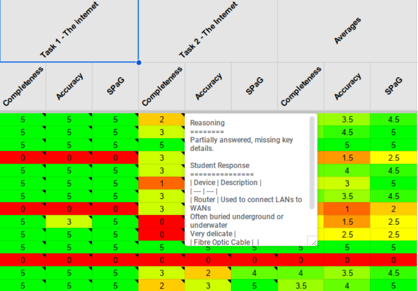

# Google Slides Assessor

**A tool designed by a Digital Technology and Computer Science teacher (and head of department) to simplify tracking and assessing the work of hundreds of students.**  

This tool pulls Google Slides from Google Classroom assignments and evaluates them on **Completeness**, **Accuracy**, and **SPaG** (Spelling, Punctuation, and Grammar), scoring each out of 5.

- [Google Slides Assessor](#google-slides-assessor)
  - [🎯 Key Features](#-key-features)
  - [🛠️ How It Works](#️-how-it-works)
  - [🔒 Privacy and Security](#-privacy-and-security)
  - [❓ What Can It Assess?](#-what-can-it-assess)
  - [🤔 Is It Perfect?](#-is-it-perfect)
  - [💸 Cost?](#-cost)
  - [⚙️ Setup](#️-setup)
  - [🤝 Contributing](#-contributing)
  - [🚀 Why Use This Tool?](#-why-use-this-tool)

---

## 🎯 Key Features
- **Automated Assessment**: Quickly evaluates student submissions against a reference and template.
- **Customisable Marking**: Identify key elements for assessment using Alt Text markers:  
  - `#` for text or tables  
  - `~` or `|` for images
- **Detailed Reporting**: Generates a well-organised spreadsheet with:
  - Student scores
  - A preview of their work
  - Performance averages across assignments
- **Future-Proof**: A department-wide Quality Assurance view is in development.

---

## 🛠️ How It Works
1. **Preparation**:
   - Create a **perfect reference** with all tasks completed correctly.  
   - Provide a **blank template** for students to complete.
2. **Marking Tasks**: Use Alt Text markers (e.g. `Task 1 – Do this thing`) to identify the parts to assess.  
3. **Assessment**:  
   The tool pulls student submissions from Google Classroom and uses `Google Gemini Flash 1.5` via a [Langflow](https://github.com/langflow-ai/langflow) backend to:
   - Compare submissions to the reference
   - Score based on Completeness, Accuracy, and SPaG
4. **Reporting**:  
   Results are compiled into a beautifully formatted spreadsheet (because SLT loves spreadsheets—admit it, so do you). The sheet includes:
   - Individual scores
   - Work previews
   - Class-wide averages

---

## 🔒 Privacy and Security
Your students’ privacy is a top priority. Here's how their data is protected:  
- **No intentional sharing of PII**: The tool only processes data within the user’s Google Workspace account, managed by the educational institution.  
- **Mitigations against accidental PII submission**:
  - **Ephemeral image storage**: The Langflow cache folder is deployed on a **ramdisk**, ensuring uploaded images exist only temporarily.  
  - **GDPR compliance**: The tool integrates with the GDPR-compliant version of the Gemini Flash API. While this comes with a small cost, it ensures adherence to strict privacy standards.
- **FOSS Transparency**: The entire tool, including the Langflow backend, is **free and open-source software (FOSS)**. If you don’t trust my word, you can inspect the source code yourself!
- **HWB Ready**: The tool works seamlessly with HWB accounts! 🏴‍☠️  

By design, this tool minimises any long-term storage of student data and maintains a secure, private workflow.

---

## ❓ What Can It Assess?
The tool works with:
- **Text**
- **Tables** (converted to Markdown for easier processing)
- **Slide Images**

It’s been tested successfully on:
- **Factual content**
- **Block code** (e.g., MakeCode for Microbit)
- **Basic persuasive writing**

---

## 🤔 Is It Perfect?
Not quite. While **LLMs aren’t infallible**, the tool is reliable enough to provide a snapshot of:
- Who’s on track
- Who needs extra support

It’s still up to you to address misconceptions, motivate students, and do all those good old-fashioned teachery things.

---

## 💸 Cost?
**Surprisingly low.** Google Gemini Flash costs around **£2–3 per month**, which easily covers monitoring ~25 classes. Hosting the Langflow backend on Google Cloud Run is similarly affordable.

---

## ⚙️ Setup
Setting it up is a bit fiddly at the moment, but improvements are in progress. Once configured, it requires minimal upkeep.  
- **Documentation**: Actively maintained—check out the [docs branch](https://github.com/h-arnold/googleSlidesAssessor/tree/docs/docs) for updates.

---

## 🤝 Contributing
Contributions are very welcome!  
If you have ideas, improvements, or bug fixes, feel free to open a **Pull Request (PR)**.  

Some areas we’d particularly appreciate help with:  
- Improving setup simplicity  
- Expanding documentation  
- Refining the Quality Assurance view  

---

## 🚀 Why Use This Tool?
- Save time while managing hundreds of students.
- Get actionable insights at a glance.
- Use it for everything from basic content checks to QA-ready reporting.  

Feedback and contributions are welcome—this project is a work in progress!
