# 📚 Create Classroom Assessment Records in Google Drive

- [📚 Create Classroom Assessment Records in Google Drive](#-create-classroom-assessment-records-in-google-drive)
    - [❗ Important Note](#-important-note)
      - [📂 Copying the template files](#-copying-the-template-files)
      - [📝 Populating the Assessment Record Generator with your classes](#-populating-the-assessment-record-generator-with-your-classes)
      - [🔧 Preparing to create the Assessment Records](#-preparing-to-create-the-assessment-records)
      - [🛠 Setting up the Assessment Record Template](#-setting-up-the-assessment-record-template)
      - [📍 Setting the location of the Assessment Record Template](#-setting-the-location-of-the-assessment-record-template)
      - [📁 Setting the destination folder of the Assessment Records](#-setting-the-destination-folder-of-the-assessment-records)
      - [🚀 Creating the assessment records](#-creating-the-assessment-records)

---

### ❗ Important Note

For testing purposes, you only need to make a copy of the template file once and find the `CourseID` (the unique identifier for a Google Classroom class). Place it in cell `B2` on the `ClassInfo` sheet.

---

#### 📂 Copying the template files

1. Make a copy of the template files from [here](https://drive.google.com/drive/u/0/folders/16DcR-0sXJQasrX6kjw-l9F-1evMFT8fk).

   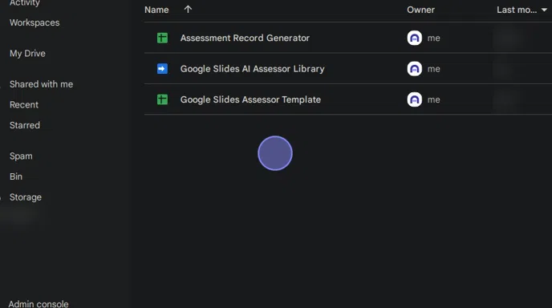

2. Move those files to wherever you want to store them in Google Drive. In this example, we've created a folder called **Classroom Assessment Records**.

   **💡 Tip:** Double-check the root of your drive if you cannot find the files.

   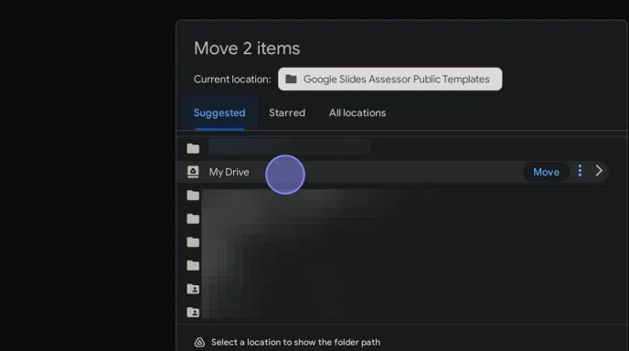

---

#### 📝 Populating the Assessment Record Generator with your classes

3. Double-click **Copy of Assessment Record Generator**.

   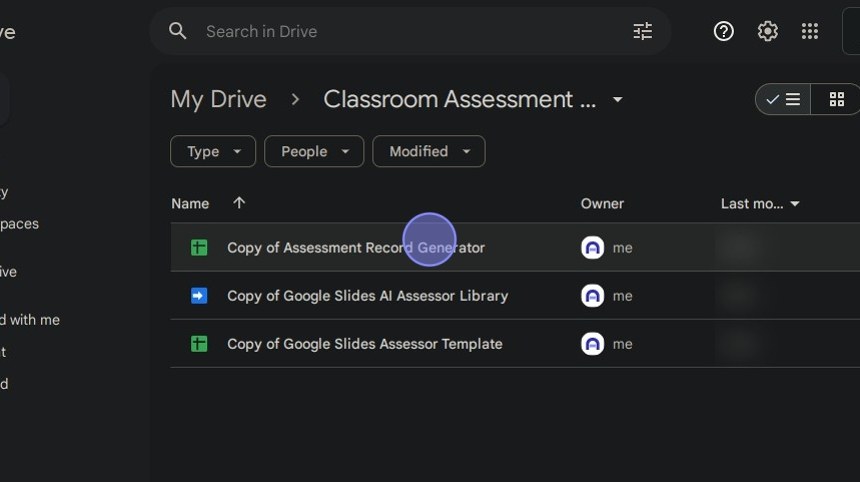

4. Click **Classroom Creator** and then **Get Google Classrooms**.

   **Note:** The menu may take a few seconds to appear the first time you open the document.

   

5. You will be prompted to authorise the script. You only need to do this once.

   **⚠️ Note:** After authorisation, repeat the previous step.

6. The script will populate the Google Sheet with all your Google Classrooms.

   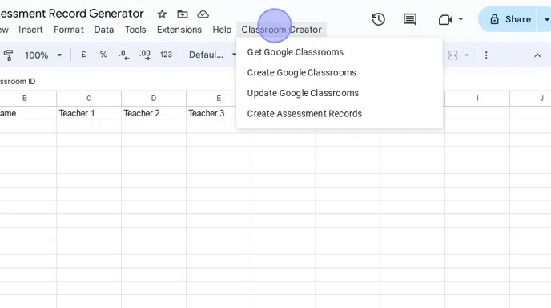

   **💡 Tip:** At the start of the year, you can get the script to create all your Google Classrooms by filling in the required details. **Teacher 1** will be the main teacher of the class.

---

#### 🔧 Preparing to create the Assessment Records

7. There are two preparatory steps you **must** take:

   - Set up the Assessment Record Template sheet with your copy of the library script.
   - Create the destination folder for storing the assessment records.

---

#### 🛠 Setting up the Assessment Record Template

8. Set up the Assessment Record Template with your copy of the **Google Slides AI Assessor Library**.

   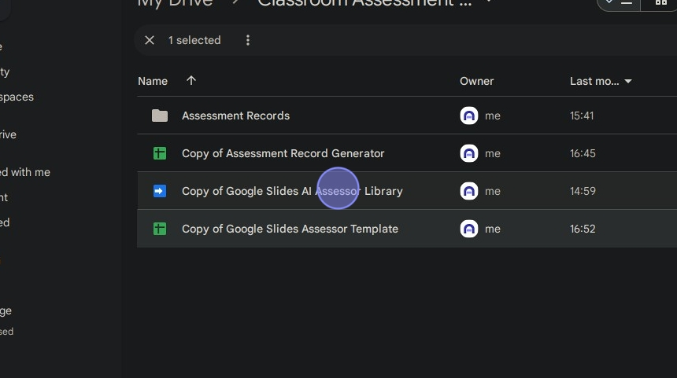

---

#### 📍 Setting the location of the Assessment Record Template

23. Open the **Google Slides Assessor Template**.

   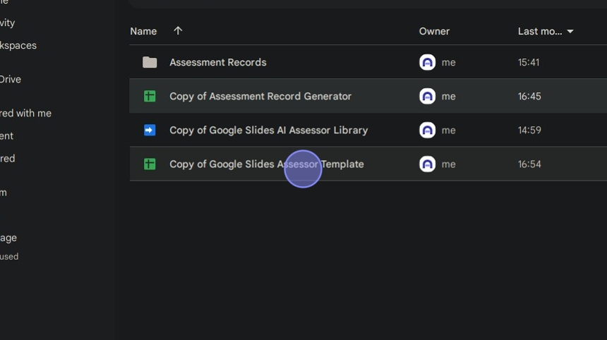

24. Copy the Google Sheet ID (the part of the URL after `/d/` and before `/edit`).

   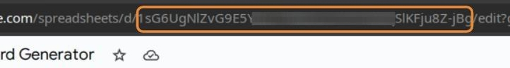

---

#### 📁 Setting the destination folder of the Assessment Records

29. Navigate to the folder in Google Drive where you want to store the assessment records.

30. Copy the folder ID (the last part of the URL made up of random characters).

   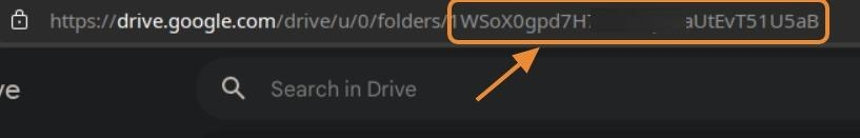

---

#### 🚀 Creating the assessment records

36. Click **Classroom Creator**.

   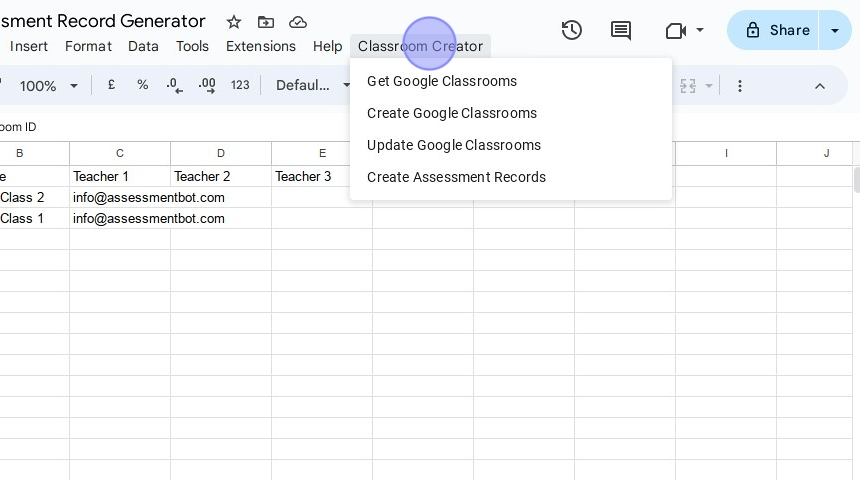

37. Click **Create Assessment Records**.

   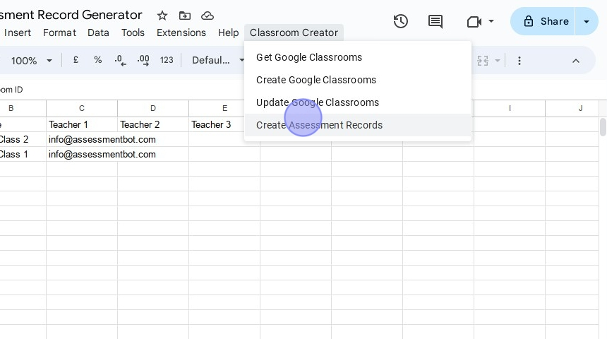

38. 🎉 All going well, your assessment records folder should now be populated!

   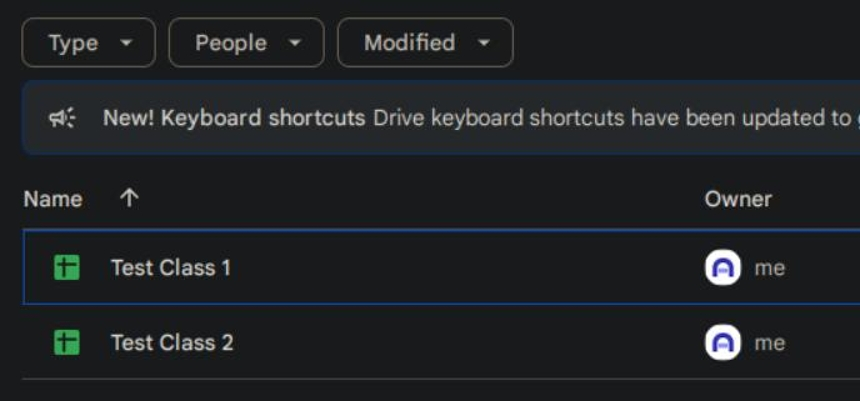
