# Create Classroom Assessment Records in Google Drive
#### [Made by Hamish Arnold with Scribe](https://scribehow.com/shared/Create_Classroom_Assessment_Records_in_Google_Drive__b7W88azVRgmFyQkQY7peEg)

#### Copying the template files

1\. Make a copy of the template files from [here](https://drive.google.com/drive/u/0/folders/16DcR-0sXJQasrX6kjw-l9F-1evMFT8fk).

2\. Now move those files to wherever you want to store them in Google Drive. In this example, we've created a folder called 'Classroom Assessment Records'.

**Tip:** Double check the root of your drive if you can't find the files.

#### Populating the Assessment Record Generator with your classes

3\. Double-click "Copy of Assessment Record Generator"

4\. Click "Classroom Creator" then 'Get Google Classrooms'.

**Note:** The menu may take a few seconds to appear the first time you open the document.

5\. You will then be asked to authorise the script. You will only need to do this once but the script will not run unless you do so.

**Note:** Nothing will happen after you authorise the script. You will need to do the step above again.

6\. Click "Classroom Creator" and "Get Google Classrooms" again.

This time, the script will populate the Google Sheet with all of your Google Classrooms.

Tip: Tip!

If you're setting this up at the beginning of the year, you can get the script to create all your Google Classrooms by filling in the details for each of the columns. Teacher 1 is the main teacher of that class.

#### Preparing to create the Assessment Records

7\. There are two preparatory steps you **must** take before creating the Assessment Records. These are:

1. Setting up the Assessment Record Template sheet with your copy of the library script.
2. Creating the destination folder where you are storing the assessment records.
3. Putting the above's respective file and folder IDs in the Assessment Record Populator.

#### Setting up the Assessment Record Template

8\. This part sets up the Assessment Record Template with your copy of the Google Slides AI Assessor Library.

Setting up the templates with a library means that you can update the code for all the created Assessment Records at once without having to update each one individually.

Alert: It's important that you set up your own copy because all the reference Google Slide IDs are stored as a script property. This means that if you are in a department of more than one, only person needs to add in the reference slide ID for each Google Classroom Assignment, saving you a lot of day to day hassle!

9\. Go back to where you made a copy of the three main files at the beginning of this tutorial.

10\. Open your copy of the Google Slides AI Assessor Library

11\. Click "Project Settings"

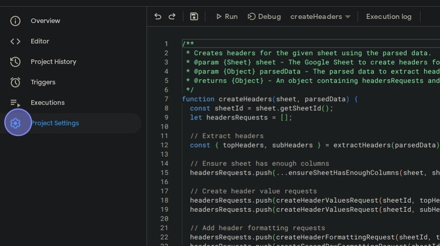

12\. Find the script ID and click "Copy"

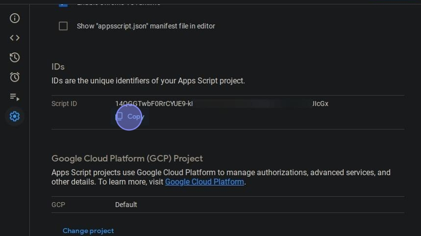

13\. Now open the Google Slides Assessor Template.

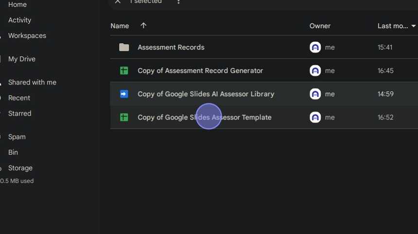

14\. Click "Extensions"

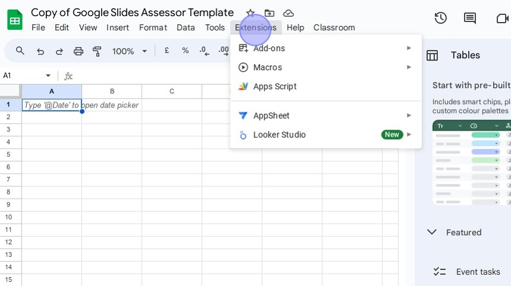

15\. Click "Apps Script"

16\. Click the [[+]] sign next to "Libraries"

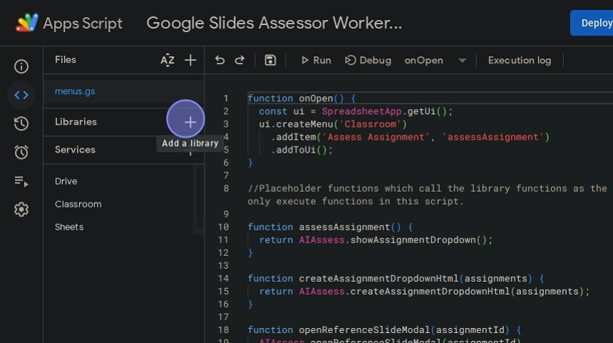

17\. Click the "Script ID" field.

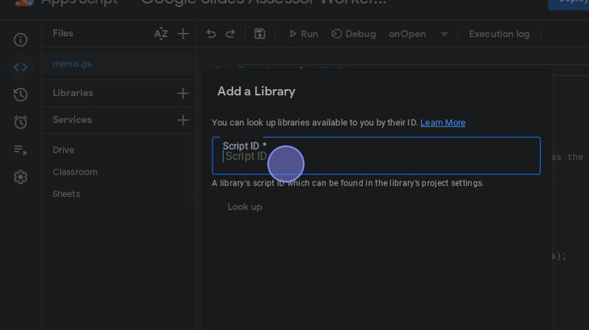

18\. Paste the Google Slides Assessor Library script ID you copied earlier  [[ctrl]] + [[v]]

19\. Click here.

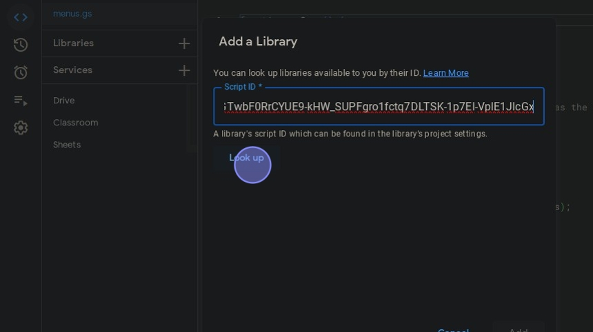

20\. Change the identifier to 'AIAssess'.

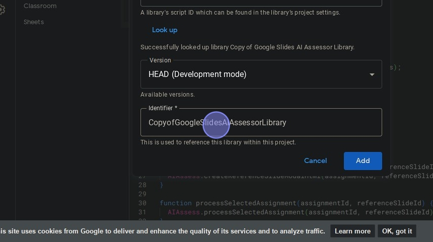

Alert: If you don't change the identifier to 'AIAssess', the Assessment Record code won't work.

21\. Click [[Add]]

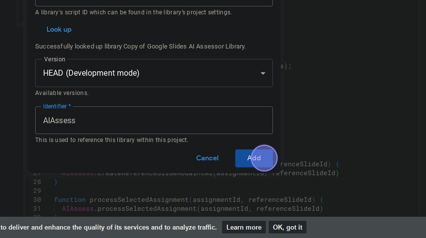

22\. The Assessment Record template is now ready to go!

#### Setting the location of the Assessment Record Template

23\. Open the Google Slides Assessor Template

24\. Copy the Google Sheet ID (the bit in the URL after '/d/' and before '/edit').

25\. Click "Extensions"

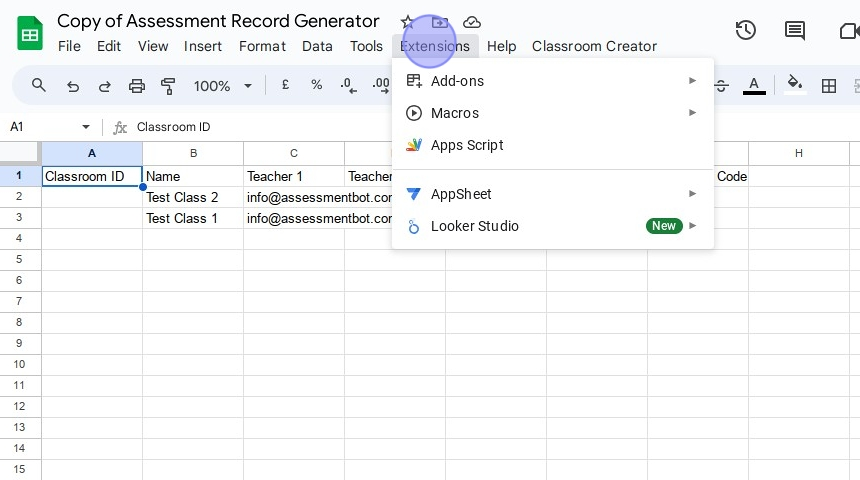

26\. Click "Apps Script"

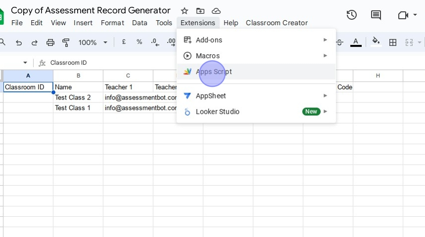

27\. Paste the Google Sheet ID you just copied between the speech marks of "PUT YOUR TEMPLATE SHEET ID HERE".

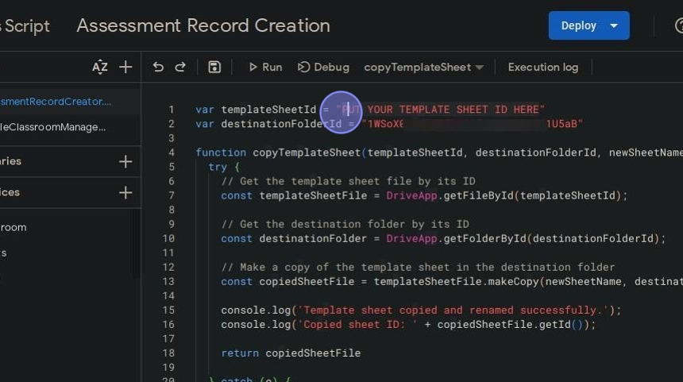

28\. Save the script.

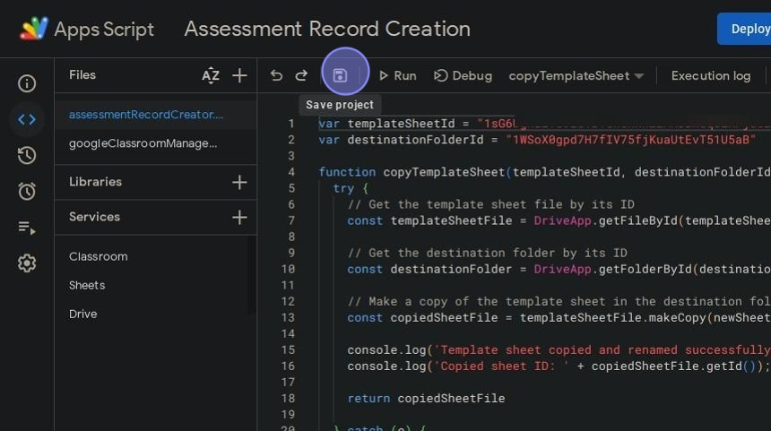

#### Setting the destination folder of the Assessment Records

29\. Navigate to the folder where you want your Assessment Records to be stored in Google Drive.

30\. Copy the folder ID \[ctrl + c\], which is the last part of the URL made up of random characters.

31\. Go back to the Assessment Record Populator Google Sheet.

32\. Click "Extensions"

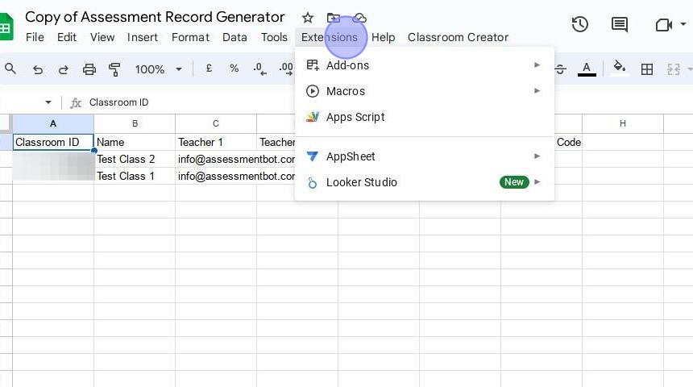

33\. Click "Apps Script"

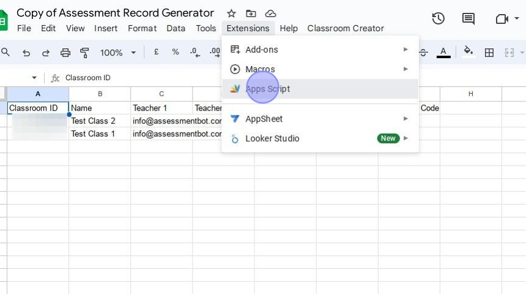

34\. Replace the value next to [[var destinationFolderId = ]] with the folder ID you copied earlier.

**Note:** Make sure you keep the speech marks either side of the folder ID.

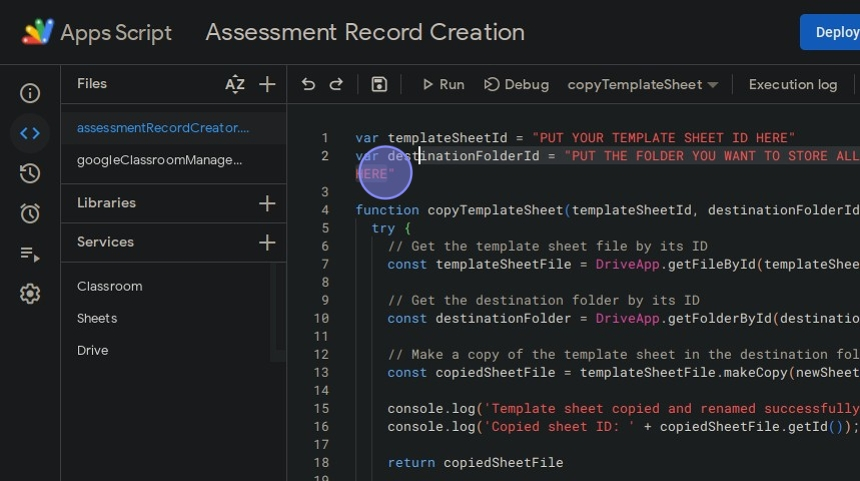

35\. Save the script.

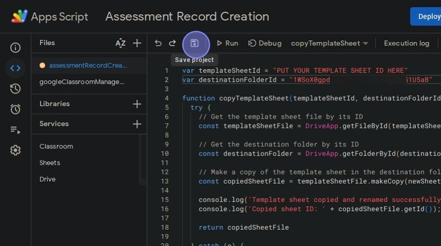

#### Creating the assessment records

Alert: Make sure the sheet with your Google Classroom courses on it is called 'Active Courses', otherwise it won't generate the assessment records.

36\. Click "Classroom Creator"

37\. Click "Create Assessment Records"

38\. All going well, you should now find that the assessment records folder you created earlier is now populated with assessment records.

#### [Made with Scribe](https://scribehow.com/shared/Create_Classroom_Assessment_Records_in_Google_Drive__b7W88azVRgmFyQkQY7peEg)

